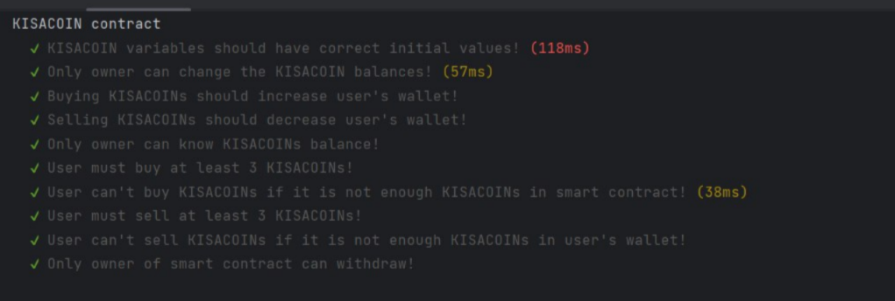

Contract description. Functions:

1. readCurrencyBuyKISACOIN - Allows to the users get currencyBuyKISACOIN
2. readCurrencySellKISACOIN - Allows to the users get currencySellKISACOIN
3. amountKISACOINTBALANCE - Allows to the users get their KISACOIN balance
4. refill - Allows the owner to increase the smart contract's KISACOIN balance
5. buyKISACOIN - Allows to anyone buy KISACOINs
6. sellKISACOIN - Allows to anyone sell KISACOINs
7. withdrawAll - Allows to owner send ETH

How to run tests:

1. Download NodeJS environment for JS
2. yarn install
3. npx hardhat compile
4. npx hardhat test

